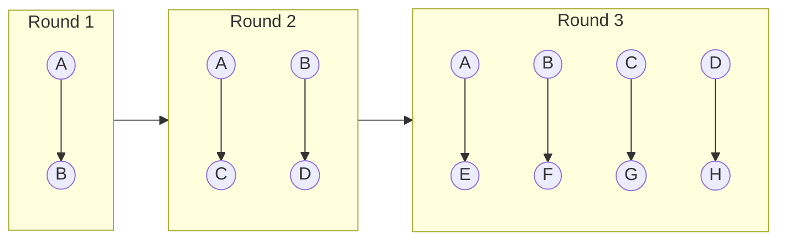
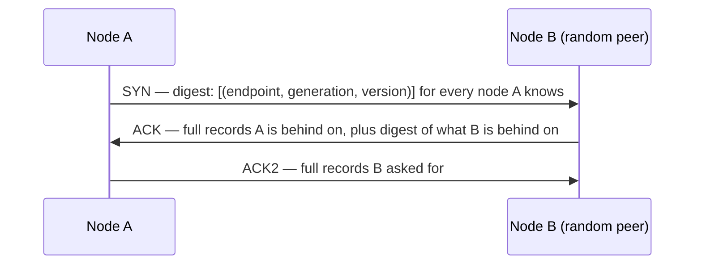

# Gossip Protocol

How a cluster of nodes learns who is in it, who is alive, and what each node currently
claims, without a master to ask.

## Problem

Every node in a distributed store needs the same answers to three questions: which
nodes exist, which are reachable, and what does each one own. The obvious designs
each break:

- **Central registry.** One place to ask, one place to fail. Every node polling it turns
  membership into the busiest service in the cluster.
- **Broadcast.** Each change sent to all N nodes is O(N) messages per change, O(N²) if
  every node also announces its own view. Fine at 10 nodes, ruinous at 1,000.
- **Heartbeat to everyone.** Same O(N²) cost, every second, forever.

Gossip trades exactness for cost: each node talks to a few random peers each round, and
information spreads like an epidemic. The cost per node is constant regardless of N, and
the spread completes in O(log N) rounds.

## Core idea



Every second, each node picks one or a few random peers and exchanges what it knows.
Anything one node learns, it passes on in its own next rounds. Informed nodes roughly
double each round, so a fact reaches everyone in about log₂ N rounds plus a tail for the
unlucky stragglers.

```
Rounds to reach all N nodes (push, fanout 1)   ≈ log₂ N + ln N
    N = 36                                       ≈ 5 + 4  = 9 rounds   ≈ 9 s at 1 round/s
    N = 1,000                                    ≈ 10 + 7 = 17 rounds  ≈ 17 s
Push-pull with fanout 3 roughly halves this.
```

Convergence takes seconds, not milliseconds. That makes gossip the right tool for
membership, health, and configuration, where a few seconds of staleness is harmless, and
the wrong tool for anything a client request is waiting on.

## What is gossiped

Each node owns one record and only it may change that record. Everyone else holds a copy
and forwards it. A record looks like:

```
endpoint       10.0.3.7:7000
generation     1726531200      -- wall-clock at process start; bumps on every restart
version        48127           -- increments on every change to any field below
heartbeat      48127           -- bumped every round; the liveness signal
state          UP | JOINING | LEAVING | DOWN | REMOVED
tokens         [ 2^63 × 0.12, 2^63 × 0.41, ... ]   -- what this node owns on the ring
load, schema version, rack/AZ, ...
```

Merging two copies of the same record is a comparison, not a negotiation: higher
`generation` wins, then higher `version`. Generation is what makes a restarted node's
fresh state beat the stale copies everyone else still holds.

## A round: the three-way exchange

Push-pull, as Cassandra does it. Sending digests first keeps the common case (nothing
changed) cheap.



```
Digest size          N × (endpoint 6 B + generation 8 B + version 8 B)  ≈ 22 B × N
    N = 36                                                               ≈ 0.8 KB
    N = 1,000                                                            ≈ 22 KB
Per node per second  fanout 1 → one SYN out, one in                      ≈ 2 × digest
    N = 1,000                                                            ≈ 45 KB/s
Full record          ~1 KB; sent only when a digest shows it is stale
```

The digest grows linearly with N, which is why gossip clusters are typically hundreds of
nodes and not tens of thousands, and why the record must stay small: a node that gossips
its full list of 10,000 hot keys turns every round into a megabyte.

**Peer selection.** One random live node per round, plus with some probability a seed
node (to heal partitions that split the random graph) and a node currently marked down
(to notice when it comes back). Nothing else; deterministic patterns create nodes that
never hear from each other.

## Styles

| Style | What is sent | Cost | Convergence | Used for |
| ----- | ------------ | ---- | ----------- | -------- |
| Anti-entropy (push-pull) | Digest of everything, then diffs | O(N) digest per round | Guaranteed, eventually | Membership state (the exchange above) |
| Rumor mongering (push) | Only new updates, for k rounds then stop | O(1) per update | Fast, but a small chance of missing a node | Broadcasting a config change; SWIM's piggybacked updates |
| Pull | "What's new since version v?" | Cheap when nothing changed | Fast for hot updates, slow tail | Config propagation |

Anti-entropy is the reliable one and the one that costs bandwidth. Rumor mongering is
fast and cheap but can leave a straggler behind. Real systems run both: rumors for
speed, anti-entropy as the backstop.

## Failure detection

Liveness is inferred from the heartbeat field arriving via gossip, not from direct pings
to every node. The question is when "no update for a while" becomes "down."

**Fixed timeout.** Mark down after, say, 10 s of silence. Simple, and wrong in both
directions: too short during a GC pause or a network hiccup (false positives cascade),
too long for a real failure (writes go to a dead node for 10 s).

**Phi accrual.** Instead of one timeout for everyone, remember how regularly each peer's
heartbeats usually arrive and ask how unusual the current silence is *for this peer*.
Suspicion (φ) climbs with the silence, steeply for a punctual peer and slowly for an
erratic one; the cluster sets one threshold (Cassandra: 8) and each peer's history
decides how many seconds that means:

```
Peer whose heartbeats arrive every second, give or take 0.1 s   → down after ~2 s of silence
Peer on a noisy link, every second give or take 0.5 s           → down after ~5 s
```

Nobody tunes a timeout per link; the history does it. A GC pause on a normally punctual
node still trips the detector, which is correct: for that node, it *is* abnormal.

**SWIM.** The alternative to heartbeats-in-gossip: each round, ping one random peer
directly. On no reply, ask k other nodes to ping it for you (an indirect probe, which
distinguishes "it is dead" from "my link to it is bad"). Only after that is it marked
*suspected*, and it has a grace period to refute the suspicion before it is declared
dead. Membership changes ride along on the ping messages. Cheaper per round than
digests and with bounded false-positive rates; this is what HashiCorp's memberlist
(Consul, Nomad) uses.

| | Heartbeat via gossip + phi accrual | SWIM |
| - | - | - |
| Detection cost | Free; heartbeats are in the digest anyway | One direct ping per round per node |
| Detection time | ~2–10 s depending on link | Bounded: ping + indirect probe + suspicion timeout, typically ~5 s |
| False positives | Adaptive per link | Bounded by indirect probing |
| Carries state | Yes, arbitrary per-node records | Membership only; state goes elsewhere |
| Used by | Cassandra, Akka, Riak | Consul, Nomad, Serf, some Kubernetes CNIs |

## What a "down" verdict may trigger

Only cheap, reversible things: route around it, start hinted writes, alert. **Never data
movement.** A partition makes every node on each side declare the other side dead, and if
that triggered rebalancing, both halves would start streaming terabytes to replace nodes
that are fine. Rebalancing is an explicit operator or automation action on a node whose
state is set to `LEAVING` or `REMOVED` by the operator, gossiped like any other change.

## Failure modes

**Ghost nodes.** A node is decommissioned and its record deleted from every live node.
Then a node that was down for a week comes back with the old record and gossips it, and
the decommissioned node is "alive" again in everyone's view. Fix: a removed node is
gossiped as `REMOVED` with a tombstone that persists for ~3 days, longer than any node is
allowed to be away, and any copy with a lower generation is refused.

**Flapping.** A node on a saturated link crosses the phi threshold, is marked down,
recovers, is marked up, repeatedly. Each transition is gossiped fleet-wide. Damping:
require a minimum time in each state, and back off the up-transition after repeated
flaps.

**Partition.** Both sides converge on a view where the other side is down. Each side
keeps serving with reduced replicas. On heal, generations and versions reconcile
automatically since the records only ever move forward. This is fine *as long as nothing
irreversible was triggered by the down verdicts* (see above).

**All seeds down.** A new node cannot bootstrap because the seeds it was configured with
are unreachable, even though the cluster is healthy. Seeds are ordinary nodes with no
special role beyond bootstrap, so run at least one per zone and keep the list current.

**State bloat.** Someone adds a 50 KB field to the record. Digests are unchanged but every
version bump now ships 50 KB to every node, and convergence time grows with message size
once the network is the bottleneck. Keep the record to what membership needs; put
everything else in the data plane.

**Large clusters.** At 1,000+ nodes the O(N) digest and the O(log N) convergence both
show. Options: hierarchical gossip (gossip within a zone, elect a few nodes to gossip
between zones), or give up and move membership to a small Raft-backed registry with
gossip only for liveness. Most systems that grow this large do the latter.

**Time.** Generation is wall-clock at start. A node whose clock is a year behind restarts
with a generation *lower* than its previous one, and its fresh state loses to everyone's
stale copy. Refuse to start if the clock is behind the last generation on disk.

## In the wild

- **Cassandra / ScyllaDB** — the model above almost exactly: three-way push-pull every
  second, generation and version per endpoint, phi accrual with threshold 8, seeds,
  tombstoned removals.
- **Amazon Dynamo** — gossip for membership and ring ownership; the paper's Section 4.8.
- **Consul / Nomad / Serf** — SWIM via memberlist, with HashiCorp's Lifeguard extensions
  that reduce false positives when the *observing* node is the slow one.
- **Redis Cluster** — a gossip bus on a separate port carrying node state, slot ownership,
  and failure reports; a node is failed when a majority of masters report it.
- **Akka Cluster** — gossip with vector clocks for the membership state and phi accrual
  detection.
- **Bitcoin** — transaction and block propagation is rumor mongering across an unstructured
  overlay; convergence in seconds across ~10k nodes.

## References

- [Epidemic Algorithms for Replicated Database Maintenance](https://dl.acm.org/doi/10.1145/41840.41841) — Demers et al., PODC 1987. The origin: anti-entropy, rumor mongering, and the convergence math.
- [SWIM: Scalable Weakly-consistent Infection-style Process Group Membership Protocol](https://www.cs.cornell.edu/projects/Quicksilver/public_pdfs/SWIM.pdf) — Das, Gupta, Motivala, DSN 2002.
- [The φ Accrual Failure Detector](https://www.researchgate.net/publication/29682135_The_ph_accrual_failure_detector) — Hayashibara et al., SRDS 2004.
- [Lifeguard: Local Health Awareness for More Accurate Failure Detection](https://arxiv.org/abs/1707.00788) — Dadgar, Phillips, Currey, 2017.
- [Cassandra: Gossip](https://cassandra.apache.org/doc/latest/cassandra/architecture/dynamo.html#gossip) — the three-way handshake and endpoint state as implemented.

## Related

- [key-value-store](../key-value-store/design.md) — uses gossip for membership, ring
  ownership, and failure detection; its failure-modes section is where "never trigger
  data movement from a down verdict" comes from.
- [lsm-tree](lsm-tree.md) — the other building block that design leans on.
- [interview-playbook](interview-playbook.md).
