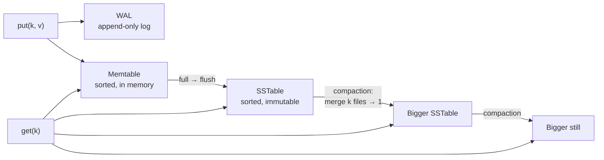

# LSM Tree

The log-structured merge tree: the storage engine that turns random writes into
sequential ones by buffering them in memory, flushing sorted runs to disk, and merging
those runs in the background.

## Problem

A B-tree updates data in place. Every write finds the page holding the key, modifies it,
and writes the page back. On disk that is a random 4–16 KB write per logical write of a
few hundred bytes, plus a write-ahead log entry to make it crash-safe. Three consequences:

- **Write amplification of 10–100×** at the page level, on media where sequential
  throughput is 10× random throughput (disk) or where every write consumes finite
  endurance (SSD).
- **Throughput bounded by random IOPS**, not bandwidth. A disk that streams 200 MB/s
  does ~200 random writes/s.
- **Fragmentation and page splits** under sustained inserts of non-sequential keys.

The LSM tree's bet: never update in place. Append everything, sort in memory, write
sorted files, merge files later. Reads pay for it by having to look in more than one
place.

## Core idea



Every write goes to a log (for durability) and a sorted in-memory table (for lookup).
When the table fills, it is written out as one sequential file — a **sorted string
table (SSTable)** — and never modified again. Background **compaction** merges several
SSTables into one, dropping overwritten and deleted versions. A read checks the
memtable, then SSTables newest to oldest, and stops at the first hit.

The whole design is the trade between three amplifications, and every compaction
strategy is a different point on that trade.

## Components

**Write-ahead log (WAL).** Append-only, one fsync per batch. A write is durable once its
WAL record is fsynced; the memtable insert can be lost to a crash and replayed. Group
commit — fsync every ~1 ms or every ~1 MB, whichever first — makes 10k writes/s cost
1k fsyncs/s. The WAL is deleted once its memtable has been flushed.

**Memtable.** A sorted in-memory structure, usually a skip list (lock-free inserts,
ordered iteration for flush). 64–256 MB typical. When full it becomes *immutable* and a
new one takes writes while the old one flushes; reads check both.

**SSTable.** An immutable file of sorted key-value pairs, laid out as:

```
[ data block ][ data block ] ... [ data block ]     -- 4–64 KB each, compressed
[ index block ]                                     -- first key of every data block
[ bloom filter ]                                    -- ~10 bits/key
[ footer ]                                          -- offsets of index and filter, checksum
```

Every block carries a checksum. The index and bloom filter are small enough to keep in
memory for every open SSTable, so a lookup is: filter says maybe → binary-search the
index → read exactly one block.

**Bloom filter.** Per SSTable, answers "definitely not here" or "maybe here."

```
10 bits/key    → ~1% false positives
14 bits/key    → ~0.1%
170M keys × 10 bits                                ≈ 210 MB per node
```

This is what makes reads of absent keys nearly free and reads of present keys touch
1–2 files instead of all of them.

**Block cache.** Recently read data blocks, uncompressed, in memory. Sized to the hot set.
The OS page cache holds compressed blocks underneath it.

**Manifest.** A log of which SSTables exist at which level, updated atomically on every
flush and compaction. Recovery replays it to rebuild the file set.

## Read path

```
1. memtable                            ~1 µs
2. immutable memtables being flushed   ~1 µs each
3. for each SSTable, newest first:
     bloom filter                      ~100 ns   → skip on "no"
     index block (in memory)           ~1 µs
     data block: cache hit             ~10 µs
                 cache miss, NVMe      ~100 µs
4. return first hit; a tombstone or expired cell is a NOT_FOUND
```

**Read amplification** is the number of places checked. With bloom filters it is
roughly "1 + number of SSTables holding that key," which depends entirely on the
compaction strategy.

## Compaction

Compaction reads several SSTables, merge-sorts them (they are already sorted, so this is
a streaming k-way merge), drops shadowed versions and expired tombstones, and writes one
new SSTable. It is what bounds the number of files a read must check, and it is also
where nearly all of the disk I/O goes.

| Strategy | How | Write amp | Read amp | Space amp | Best for |
| -------- | --- | --------- | -------- | --------- | -------- |
| Size-tiered (STCS) | Merge ~4 similar-sized tables into one bigger one | ~4–6× | High: many tables per level, a key may be in several | Up to 2× during a merge | Write-heavy; SSD endurance budgets |
| Leveled (LCS) | Levels of 10× increasing size; each level is non-overlapping sorted runs; merge one file from Lₙ into Lₙ₊₁ | ~10–30× | Low: one file per level, ~L files total | ~1.1× | Read-heavy; space-constrained |
| Time-window (TWCS) | Size-tiered within a time bucket; never merge across buckets | ~2× | Low for recent data | Low | Time-series with TTL; whole files expire at once |
| FIFO | Never merge; delete oldest files when over budget | 1× | High | 1× | Caches, logs |

**Why the numbers.** Leveled compaction moves each byte through every level, and at
each level it rewrites ~10 bytes of the next level for every byte merged in (the level
is 10× bigger and overlapping). Five levels ≈ 10 per level ≈ tens of rewrites per byte.
Size-tiered rewrites each byte once per tier, and there are only log₄(data/memtable)
tiers ≈ 5. The price is that size-tiered can have several tables of the same size
overlapping the same keys, so a read may touch all of them, and merging two 1 TB tables
needs 2 TB of scratch space until the merge finishes.

**The RUM trade-off.** Read, update (write), and memory/space amplification cannot all
be minimised at once. Leveled buys reads and space with writes. Tiered buys writes with
reads and space. The choice is a workload decision, not a default, and the
[key-value-store sizing](../key-value-store/back-of-the-envelope.md#4-node-count) shows
one case where SSD endurance made it for us.

**Throttling.** Compaction competes with foreground reads for disk. Cap concurrent
compactions (2–4) and rate-limit their I/O; it is better to fall slightly behind on
merging than to serve reads at 10× latency.

## Deletes, TTL, and tombstones

Nothing is modified in place, so a delete is a write: a **tombstone** cell with the key,
no value, and a timestamp. Reads that find a tombstone first return NOT_FOUND. Compaction
drops the tombstone *and* the older values it shadows once it can see all of them in the
same merge.

A tombstone cannot be dropped the moment it is written, because in a replicated system a
replica that missed the delete would resurrect the value at the next repair. It is kept
for a **grace period** (Cassandra: 10 days by default), and the invariant is *repair
cycle < grace period*.

TTL is an expiry timestamp on the cell. Reads filter it; compaction drops it. No timers,
no sweeper. Expired data costs disk until a compaction touches it, which is why
time-window compaction exists for TTL-heavy workloads: whole files expire at once and
are unlinked without a merge.

## Write stalls and backpressure

Under sustained write load beyond what compaction can absorb, L0 files pile up, every
read checks more filters and more files, and the disk fills with unmerged tables. The
engine must push back before that:

```
L0 files > soft limit  (e.g. 20)   → delay each write by a few ms
L0 files > hard limit  (e.g. 36)   → stop accepting writes until compaction catches up
pending compaction bytes > limit   → same
```

A stall is a signal to alert on; a stalled node is one whose ingest exceeded its disk's
sustainable write rate, and the fix is more nodes or a cheaper compaction strategy, not
a higher limit.

## Tuning knobs, and what each trades

| Knob | Bigger means |
| ---- | ------------ |
| Memtable size | Fewer, larger flushes; longer WAL replay on crash; more memory |
| Bloom bits per key | Fewer false-positive disk reads; more memory |
| Block size | Better compression, fewer index entries; more bytes read per point lookup |
| L0 compaction trigger | More files before merging: better write burst tolerance, worse reads |
| Level size multiplier (leveled) | Fewer levels: less read amp, more write amp per merge |
| Compaction threads / rate limit | Faster catch-up; more interference with reads |
| Group-commit interval | Fewer fsyncs; slightly higher write latency floor |

## Failure modes

**Compaction debt.** Ingest exceeds compaction throughput for long enough that catching
up takes hours. Reads degrade continuously the whole time. Watch pending compaction
bytes; it should oscillate, never trend.

**Tombstone-heavy reads.** A queue-like workload (write, read, delete, repeat on the
same keys) leaves SSTables that are mostly tombstones. A read of a deleted key scans
through thousands of tombstones before concluding NOT_FOUND. Alert on tombstones
scanned per read; the fix is usually a shorter grace period or a different data model.

**Resurrection.** A tombstone is compacted away on one replica before another replica
learned of it. The grace-period invariant was violated, typically because repair fell
behind. Alert on time-since-last-repair per range.

**Space amplification during large merges.** Size-tiered merging two 1 TB tables needs
2 TB free. A disk at 60% can fail a merge it needs to run to get below 60%. Provision
disks at 2× the data for tiered; alert at 50%.

**WAL fsync latency.** A slow disk turns every write's ack into a wait for the next
group commit. The p99 of writes is the fsync p99; put the WAL on the fastest device or
its own device.

**Recovery time.** A crash replays every WAL that has not been flushed. With 4 × 256 MB
memtables that is ~1 GB, seconds. With 4 GB memtables it is minutes of a node being
unavailable after every restart.

**Large values.** A 10 MB value holds the memtable flush and any compaction touching it.
Cap values at the API (1 MB is common) or store large values in a separate blob log with
pointers in the tree (WiscKey / BlobDB).

## LSM vs B-tree

| | LSM tree | B-tree |
| - | -------- | ------ |
| Write pattern | Sequential | Random, in place |
| Write amplification | Tunable, 4–30× | 10–100× at page granularity |
| Read amplification | 1 + files checked; bloom filters keep it small | 1 tree descent, predictable |
| Space amplification | 1.1–2× depending on compaction | ~1×, plus fragmentation |
| Range scans | Merge across files; slower | Native |
| Latency variance | Compaction and stalls in the tail | Page splits, less variance |
| Concurrency | Immutable files: trivially safe | Latching |
| Typical use | Write-heavy KV, time-series, message logs | OLTP with in-place updates and range queries |

Neither dominates. Modern engines (WiredTiger, InnoDB, Postgres) are B-trees with a
WAL, and they are the right choice for update-in-place relational workloads. Modern
distributed KV stores are almost all LSM because their workload is append-heavy and
their disks are SSDs.

## In the wild

- **Bigtable / LevelDB** — the lineage: Bigtable's tablet servers, then LevelDB as the
  open-source distillation with leveled compaction.
- **RocksDB** — LevelDB forked and hardened at Facebook; the engine under MySQL/MyRocks,
  TiKV, Kafka Streams, Flink state, and many others. Leveled by default, with universal
  (tiered), FIFO, and blob storage available.
- **Cassandra / ScyllaDB** — LSM per node with size-tiered default and leveled and
  time-window as options; the grace-period tombstone model above is theirs.
- **HBase** — Bigtable's model on HDFS; memstore, HFiles, minor and major compaction.
- **Pebble** — CockroachDB's Go rewrite of RocksDB's design.
- **WiscKey / BlobDB** — key-value separation: keys in the tree, large values in a
  separate log, cutting compaction write amplification for big values.

## References

- [The Log-Structured Merge-Tree](https://www.cs.umb.edu/~poneil/lsmtree.pdf) — O'Neil, Cheng, Gawlick, O'Neil, 1996.
- [Bigtable: A Distributed Storage System for Structured Data](https://research.google/pubs/bigtable-a-distributed-storage-system-for-structured-data/) — Chang et al., OSDI 2006.
- [RocksDB Wiki: Compaction](https://github.com/facebook/rocksdb/wiki/Compaction) — leveled vs universal, with the amplification math as implemented.
- [Dostoevsky: Better Space-Time Trade-Offs for LSM-Tree Based Key-Value Stores](https://scholar.harvard.edu/files/stratos/files/dostoevskykv.pdf) — Dayan & Idreos, SIGMOD 2018. The tiered/leveled spectrum formalised.
- [Designing Access Methods: The RUM Conjecture](https://stratos.seas.harvard.edu/files/stratos/files/rum.pdf) — Athanassoulis et al., EDBT 2016.
- [WiscKey: Separating Keys from Values in SSD-conscious Storage](https://www.usenix.org/conference/fast16/technical-sessions/presentation/lu) — Lu et al., FAST 2016.
- *Designing Data-Intensive Applications*, Kleppmann — ch. 3.

## Related

- [key-value-store](../key-value-store/design.md) — one LSM per node, size-tiered for
  endurance; its sizing works through the amplification numbers for a real fleet.
- [gossip-protocol](gossip-protocol.md) — the other building block that design leans on.
- [interview-playbook](interview-playbook.md).
