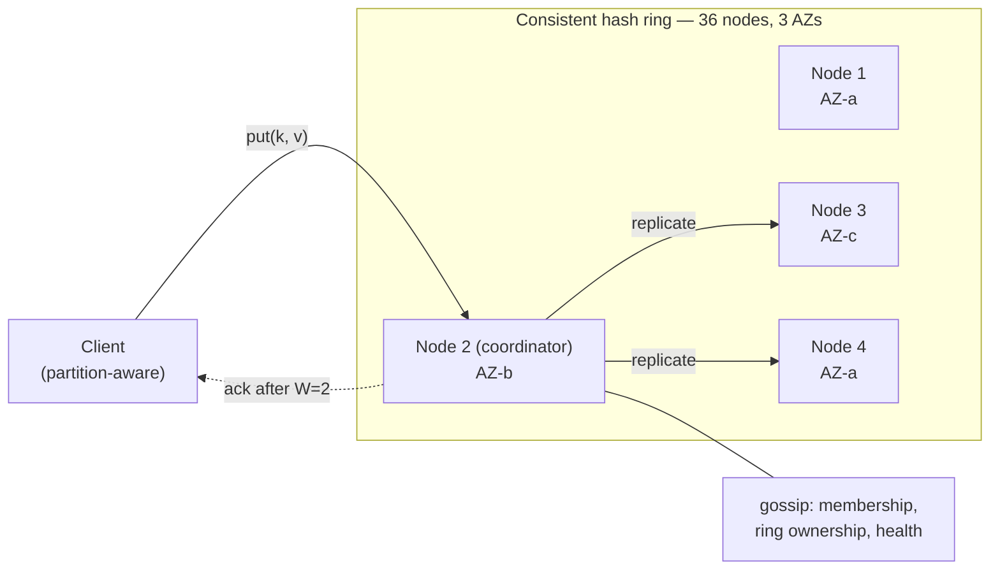
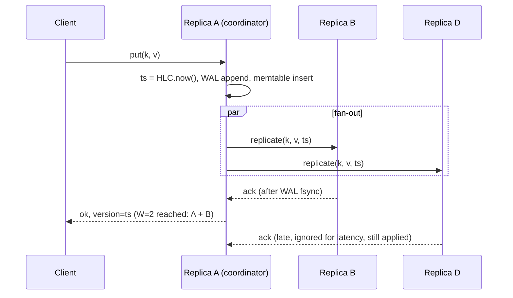

# Key-Value Store — Design

A partitioned, replicated store for opaque values addressed by a single key, that stays
writable through node and zone failures and grows by adding machines.

This is the third of three documents: [requirement.md](requirement.md) settles *what* to
build, [back-of-the-envelope.md](back-of-the-envelope.md) sizes it, and this one is the
design that satisfies both.

## Problem

A single-node store hits three walls at once and none of them can be solved separately:

- **Capacity** — 20 TB does not fit on one machine you would want to run, and 500k
  reads/s does not fit on one machine's CPU or NIC.
- **Durability** — one disk is one failure away from losing everything on it. Backups
  restore yesterday's data; they do not keep today's.
- **Availability** — one node is one reboot away from every caller getting errors.

Splitting the data across machines solves capacity but *worsens* availability: the more
machines, the more often one of them is down. Replicating it solves availability but
creates the question of which copy is right. The design is the set of answers to
"where does a key live," "how many copies," and "what happens when the copies disagree."

## Requirements

The full requirements dialogue and the reasoning behind each decision are in
[requirement.md](requirement.md). The contract this design is held to:

| Requirement | Target |
| ----------- | ------ |
| API | `get` / `put` / `delete` on one opaque key; keys ≤ 256 B, values ≤ 1 MB; per-key TTL |
| Dataset | 10 TB raw today, 20 TB planned; 1B → 2B keys, ~10 KB median value |
| Throughput | 500k reads/s, 100k writes/s design targets |
| Latency | read p99 ≤ 10 ms, write p99 ≤ 20 ms, server-side |
| Consistency | AP; tunable per request; quorum reads see quorum writes; LWW on skew-resistant timestamps |
| Durability | Ack after 2 zone-distinct durable copies; no loss on single node, disk, or AZ failure |
| Placement | One region, 3 AZs, every key on all three; partition-aware clients |
| Backup | Snapshots to object storage; RPO 6 h, RTO 4 h; per-range restore |
| Operations | Online add/remove at ≤ 5% throughput impact; automatic replacement; read-hot keys must not saturate replicas; backpressure under write overload |

Out of scope: range scans, secondary indexes, transactions, compare-and-set,
multi-region, values over 1 MB, multi-tenancy and per-key security.

## Core idea

Hash each key onto a ring; the first three nodes clockwise from the hash, in three
distinct zones, hold its replicas. Any replica can coordinate a request, fanning out to
the others and answering once a quorum agrees. Each node stores its share in a
log-structured merge tree. Nodes learn about each other by gossip, so there is no
master and nothing to elect.



Everything below is a consequence of three decisions: **consistent hashing with virtual
nodes** for placement, **leaderless quorum replication** for consistency, and an **LSM
tree** for the per-node engine.

## Approaches

Three independent choices, each with a table.

### Partitioning

| Scheme | Lookup | Rebalance on add/remove | Hot-spot risk | Range scans |
| ------ | ------ | ----------------------- | ------------- | ----------- |
| Hash mod N | Trivial | Moves ~all keys | Low | No |
| Range partitioning | Needs a directory | Split/merge ranges | High — sequential keys pile up | Yes |
| Consistent hashing | Ring walk | Moves 1/N of keys | Uneven without vnodes | No |
| Consistent hashing + virtual nodes | Ring walk | Moves 1/N, spread across all nodes | Low | No |
| Fixed logical partitions (pre-split, e.g. 8,192) | Table lookup | Moves whole partitions | Low | No |

**Pick: consistent hashing with ~256 virtual nodes per physical node.** Range partitioning
would give scans, which are out of scope, at the cost of hot spots we would then have to
engineer around. Virtual nodes are what make adding a machine pull data from every
existing node at ~6 MB/s each rather than from one neighbour at 200 MB/s.

Fixed logical partitions are the closest alternative and the one DynamoDB and Riak use:
hash keys into a fixed number of partitions, map partitions to nodes in a table. Streaming,
repair, and Merkle trees then operate on whole partitions, which is easier to reason about
than arbitrary token ranges. The cost is choosing the partition count up front and living
with it. Random vnodes were picked here because they need no coordinated map and the
gossip-only membership below keeps that property.

### Replication and consistency

| Model | Write path | Availability under partition | Consistency | Latency |
| ----- | ---------- | ---------------------------- | ----------- | ------- |
| Single leader per shard (Raft/Paxos) | Leader, then majority | Minority side rejects writes | Linearizable | +1 consensus round |
| Leaderless, tunable quorum | Any replica coordinates; wait for W | Writable if W replicas reachable; sloppy quorum → always | Eventual, quorum-overlap when R + W > N | 1 parallel fan-out |
| Async primary–replica | Primary only | Failover loses in-flight writes | Read-your-writes only on primary | Fastest |

**Pick: leaderless with tunable quorum, N = 3, default R = W = 2.** The requirement is
availability with a strong-read option, which is exactly the tunable-quorum contract.
Raft per shard would give CAS for free but costs a consensus round on every write and
stops accepting writes on the minority side of a partition. Async primary–replica cannot
meet the durability requirement.

### Storage engine

| Engine | Write cost | Read cost | Space | Notes |
| ------ | ---------- | --------- | ----- | ----- |
| B-tree (InnoDB-style) | Random I/O, in-place update | 1 seek, predictable | ~1× | Poor for 85 MB/s sustained ingest on SSD |
| Hash index + append log (Bitcask) | Sequential append | 1 seek via in-memory index | Compaction needed | Every key in RAM: 170M × ~50 B ≈ 8.5 GB, workable |
| LSM tree (RocksDB/Cassandra-style) | Sequential append | Bloom filters + ≤ few SSTable reads | 1.1–2× depending on compaction | Standard for write-heavy, tunable |

**Pick: [LSM tree](../common/lsm-tree.md) with size-tiered compaction.** Writes become
sequential, which is what sustains 85 MB/s ingest per node. Bitcask is a genuine
contender at this key count and would give faster point reads, but its all-keys-in-memory
index scales linearly with key count and becomes the binding constraint at 5B keys.
Size-tiered rather than leveled compaction because of SSD endurance —
[the sizing](back-of-the-envelope.md#4-node-count) shows leveled's ~10× write
amplification would need more than twice the nodes.

## Deep dive

### API

```
get(key, consistency = QUORUM)            → value, version   | NOT_FOUND
put(key, value, ttl = none, consistency = QUORUM) → version
delete(key, consistency = QUORUM)         → ok

consistency ∈ { ONE, QUORUM, ALL }
```

`ONE` returns after the first replica answers — fastest, may be stale. `QUORUM` waits for
⌈(N+1)/2⌉ = 2. `ALL` waits for 3 and fails if any replica is down; it exists for
operational use, not application code. A `put` with `QUORUM` followed by a `get` with
`QUORUM` sees that write, because the two sets of 2 must share a replica.

### Partitioning: the ring

```
token = hash64(key)                       -- e.g. Murmur3, uniform over 2⁶⁴
owner = first vnode clockwise from token
preference list = owner + next vnodes clockwise, skipping any whose physical
                  node or AZ is already in the list, until N = 3 distinct AZs
```

Each physical node claims 256 random tokens. With 36 nodes that is ~9,200 vnodes on
the ring, and each physical node's share of the keyspace is the sum of 256 small arcs —
which averages out imbalance to a few percent without any manual token assignment.

**AZ skipping** is the detail that makes zone failure survivable: without it, three
consecutive vnodes can easily land in the same zone. The preference list can extend past
N nodes to include fallbacks for sloppy quorum (below).

### Replication: quorums, sloppy quorums, hinted handoff

Write path at `QUORUM`:



The coordinator applies locally, fans out to the other two, and responds when it has
W = 2 acknowledgements *including its own*. Waiting for the second-fastest, not the
slowest, is what keeps the write p99 inside 20 ms.

**Sloppy quorum.** If replica D is unreachable, the coordinator writes to the *next*
node on the preference list (say E) with a **hint** attached: "this belongs to D." The
write still reaches two durable copies in two zones, so it is acknowledged. When D comes
back, E streams its hints to D and deletes them. Hints are capped at 3 hours; beyond that
the write is recovered by anti-entropy repair instead.

The cost: during the outage a `QUORUM` read that lands on A and D's replacement can miss
a write that reached A and E. Sloppy quorum trades the R + W > N guarantee for
availability, and the requirements chose availability. Clients that cannot tolerate this
use `ALL` on read, which fails loudly rather than returning stale data.

### Versioning and conflict resolution

Every stored cell carries a timestamp from a **hybrid logical clock (HLC)**: physical
time in the high bits, a logical counter in the low bits, and a rule that a node's HLC
never goes below the highest HLC it has received. Two effects:

- Concurrent writes on different coordinators get timestamps that respect causality
  when the writes are causally related (the second writer saw the first), and are
  otherwise ordered by physical time. Wall-clock skew of a few milliseconds no longer
  flips "last."
- A node whose clock is wildly off (> 1 s from its peers, learned via gossip) refuses
  to coordinate writes rather than poisoning the ordering for everyone.

**Last-writer-wins by HLC** is the default resolution: on read, the coordinator returns
the highest-timestamped version and issues a **read repair** to any replica that returned
an older one. For the few keys that genuinely have concurrent independent writers, an
opt-in `siblings` mode stores a **dotted version vector** per key and returns all
concurrent versions for the client to merge; the client's next `put` supplies the
context that resolves them. This is Riak's model and it is correct, but the requirements
were clear that it should not be the default burden.

### Deletes and TTL

A delete writes a **tombstone** — a cell with no value and a timestamp. It has to be a
write, not a removal, because a removal on two replicas and a miss on the third would
resurrect the value at the next repair. Tombstones are kept for a **grace period** longer
than the maximum hint window plus one full repair cycle (say 10 days), then dropped at
compaction.

TTL is stored as an expiry timestamp on the cell. Reads filter expired cells; compaction
drops them. No background sweeper, no per-key timer: expired data costs disk until the
next compaction touches it and nothing else.

### Storage engine: one node's LSM tree

The engine itself — WAL, memtable, SSTables, bloom filters, compaction, and the
amplification trade-offs — is in [common/lsm-tree](../common/lsm-tree.md). The choices
made for this design:

```
put ──► WAL (group-commit fsync every 1 ms or 1 MB)
    └─► memtable (skip list, 256 MB; 2 active + 2 flushing)
              │ full
              ▼
        flush ─► SSTable (bloom filter at 10 bits/key, 64 KB blocks, per-block checksum)
                     │
                     ▼ size-tiered compaction, ≤ 2 concurrent, I/O rate-limited
                 SSTable
```

- **Size-tiered, not leveled.** SSD endurance: 4× write amplification instead of ~10×
  is the difference between 36 nodes and ~80 (see [the sizing](back-of-the-envelope.md#4-node-count)).
  The price is 2× disk provisioning for merge headroom and higher read amplification,
  both affordable here.
- **Group-commit fsync** makes 8.3k writes/s per node cost ~1k fsyncs/s with no loss
  of durability: a write is not acknowledged until its fsync completes.
- **Bloom filters at 10 bits/key** cost ~210 MB per node and turn a miss into zero
  disk reads ~99% of the time; a hit touches 1–2 SSTables.
- **Every block carries a checksum**, verified on read and by a weekly scrub. A corrupt
  block is treated as a missing replica: served from the other two, then repaired from
  them. Without this, silent disk corruption replicates as if it were data.

### Backups

SSTables are immutable, so a snapshot is a directory of hard links that costs nothing to
take and holds the files until the upload finishes. Every 6 hours each node uploads the
SSTables created since its last snapshot to object storage; a manifest per snapshot
records which files make up a consistent view. Restore is the reverse: pull the manifest's
files onto empty nodes and let them serve. Because SSTables are keyed by token range, a
single application's keys can be restored by pulling only the files covering that range
and replaying them as writes with their original timestamps, which LWW then resolves
correctly against anything newer.

This is what replication cannot do: undo a delete that replicated perfectly.

### Anti-entropy: Merkle trees

Hints cover short outages; **repair** covers everything else — a node down for a day, a
disk that silently lost a block, a bug. Periodically, each node builds a **Merkle tree**
over each vnode range it holds (hash of every key's version, combined pairwise up to a
root) and exchanges it with the other two replicas. Matching roots mean nothing to do;
mismatched subtrees are walked down to the leaves and only the differing keys are
streamed. Comparing 1.7 TB costs one tree exchange, not 1.7 TB of network.

Repair runs continuously in the background, throttled, and must complete a full cycle
inside the tombstone grace period — otherwise a tombstone can be dropped from one replica
before the others learned about it.

### Membership and failure detection

No master. Nodes learn the ring, each other's state, and liveness by
[gossip](../common/gossip-protocol.md): a push-pull exchange with one random peer per
second, records merged by (generation, version), phi-accrual failure detection at
threshold 8. For 36 nodes a change reaches everyone in ~9 rounds, so ~9 s; the ring is
therefore never on the request path, only cached by clients and refreshed.

Each node's gossiped record carries its 256 tokens, its state (`JOINING` / `UP` /
`LEAVING` / `DOWN` / `REMOVED`), its AZ, and a heartbeat. Marking a node down triggers
hinted handoff for its writes; it does *not* trigger data movement. Only an explicit
**decommission** or **replace** sets a state that moves data, so a flapping network never
causes a rebalance storm.

### Client routing

The client library gossips too — or, simpler, polls any node for the ring every 30 s —
and hashes keys locally to send each request straight to a replica. This saves one
network hop on every request, which the latency budget cannot spare. A request that
lands on a non-replica (stale ring) is forwarded transparently, so correctness never
depends on the client's view being current.

The alternative is a stateless API tier in front of the ring. It is the natural home for
authentication, per-tenant quotas, and request validation, and it lets dumb clients use
the store. It also costs one hop (~1 ms) on every request, which is why the requirements
deferred multi-tenancy: adding the tier later is easy, and adding it now spends latency
on features nobody needs yet.

### Adding and removing nodes

**Add:** the new node picks 256 random tokens, announces `joining` via gossip, and
streams the ranges it now owns from their current owners at a throttled rate. It serves
writes for those ranges immediately (as an extra replica) but not reads until streaming
completes, then flips to `up`. The old owners keep serving until the flip, so there is no
gap.

**Remove (planned):** announce `leaving`, stream owned ranges to their new owners, then
`left`. **Replace (dead):** a fresh node claims the dead node's exact tokens and streams
from the other two replicas of each range. No other node's ownership changes.

### Operability

What the platform team sees, per node unless noted. Each maps to a failure mode below.

| Signal | Alert when |
| ------ | ---------- |
| Read/write latency p50, p99, p99.9 | p99 near budget; p99.9 is where compaction and GC show first |
| SSTable count, pending compaction bytes | Rising for > 1 h: compaction is losing |
| Write stall time | Any: the node is applying backpressure |
| Tombstones scanned per read | > 100: a delete-heavy workload is aging badly |
| Hint queue size and age | Age near the 3 h cap: a node has been down too long |
| Last successful repair per range (cluster) | Older than the tombstone grace period |
| Ring ownership imbalance (cluster) | Any node > 15% above mean |
| Phi suspicion per peer | Sustained high values on a node others consider healthy: its clock or NIC |
| Snapshot age and upload lag | Older than 6 h |

Every automated action (rebalance, replace, repair, compaction) exposes progress and a
pause switch. Averages are not reported anywhere; only percentiles.

### Capacity

Worked in full in [back-of-the-envelope.md](back-of-the-envelope.md). The numbers that
shape the design:

```
Design peak         500k reads/s, 100k writes/s  → 1M replica lookups/s, 300k replica writes/s
Fleet               36 nodes, 12 per AZ; 2 × 3.84 TB NVMe, 64 GB RAM, 25 GbE each
Per node            28k lookups/s, 8.3k writes/s, ~1.7 TB, ~170M keys
Binding constraint  SSD endurance: 62 TB/day ingest × 4× write amplification ≈ 7 TB/day/node
Latency             read ~2 ms p50 / 6–8 ms p99;  write ~3 ms p50 / 10–15 ms p99
```

Disks are under half full at plan capacity. Node count is set by write endurance and
throughput, which is also why compaction is size-tiered rather than leveled.

## Failure modes & scaling

**One node down.** Its ranges have 2 live replicas; `QUORUM` still works with R = W = 2.
Writes to its ranges go to a hint holder. Reads that would have gone to it are served by
the other two. Nothing rebalances. If it is not back in a few hours, an operator (or
automation) issues `replace`.

**One AZ down.** Every range loses exactly one replica, so the cluster behaves as above
for all keys at once: fully available at `QUORUM`, `ALL` fails. Write load on the
surviving 24 nodes rises by 50% for the hints. This is the case the AZ-skipping
preference list exists for; without it, some ranges would lose two replicas and go
read-only at `QUORUM`.

**Network partition.** Minority-side nodes keep accepting writes at `ONE` and, via sloppy
quorum with hints, at `QUORUM` too. Both sides diverge; HLC-LWW resolves on heal, with
the later write winning. The requirements accepted this. What must *not* happen is a
partitioned node marking every peer dead and going into a rebalance frenzy — hence
failure detection never triggers data movement.

**Read-hot key.** All reads for one key hit its 3 replicas, which at 28k lookups/s each
saturate at roughly 80k reads/s for that single key. Mitigations, cheapest first: the
coordinator coalesces concurrent reads of the same key into one lookup (single-flight),
so a thousand simultaneous requests cost one disk read; the client library caches hot
values for a short TTL (a read-heavy key by definition tolerates staleness); the
coordinator serves at `ONE` from its local copy for keys flagged hot; finally, replicate
hot keys to more nodes with an elevated N for that key's range. The requirement was "must
not saturate its replicas," and coalescing plus the client-side cache satisfy it for the
shared-config-on-boot case.

**Write-hot key.** No good answer inside the store; the last write wins and the others
were wasted. Push back on the application — a counter should be a counter, not a KV
put.

**Write overload.** A bulk import at 5× the design write rate fills memtables faster than
they flush, then produces SSTables faster than compaction merges them. Left alone, the
SSTable count climbs, every read checks more bloom filters and more files, read latency
degrades, and eventually the disk fills with un-merged tables. The defence is **write
stalls**: when the count of unmerged SSTables or the pending-compaction bytes crosses a
threshold, the node first slows writes (delays each acknowledgement by a few
milliseconds), then rejects them with a retryable error. Reads keep their priority
throughout. The requirement was "degrade, don't collapse," and a store that says "try
later" at 5× load is degrading; one that serves 500 ms reads is collapsing.

**Compaction storms.** Size-tiered compaction occasionally merges several large tables at
once, spiking disk I/O and evicting the block cache. Cap concurrent compactions and
throttle their I/O so foreground reads keep priority; accept temporary space
amplification instead of temporary latency.

**Tombstone accumulation.** A workload that writes and deletes the same keys quickly
produces tables that are mostly tombstones, and reads of those keys scan many tombstones
before finding nothing. Compaction cleans it up after the grace period; in the meantime,
monitor tombstones-per-read and alert on it.

**Resurrection.** A replica that misses a tombstone (down longer than the hint window
*and* no repair before the grace period ends) will bring the deleted value back at the
next repair. The invariant is *repair cycle < grace period*; alert if a full repair has
not completed in that time.

**Clock skew.** HLC bounds the damage: skew shorter than the interval between two
conflicting writes is irrelevant, and a node skewed by more than a threshold stops
coordinating. What HLC cannot do is order two writes 1 ms apart from nodes skewed by
10 ms; that pair resolves "wrong." The requirement was deterministic, not correct-in-all-
cases, and this is where the line falls.

**Rebalance load.** Streaming is throttled to ~200 MB/s into the new node and read at
~6 MB/s from each source, comfortably inside the 5% budget. The failure case is many
nodes joining at once: serialize joins, one at a time.

**Logical corruption.** A bad deploy that deletes or overwrites a million keys is
replicated, hinted, and repaired with perfect fidelity; nothing in the replication path
can tell it from intended writes. Only the snapshots can, by restoring the affected range
as of 6 hours ago. This is the one failure where RPO is a real loss and the requirement
accepted it.

**Large values.** 1 MB is rejected at the API. Even at 1 MB, a single value fits in one
SSTable block chain and one network message; the limit is there because a 10 MB value
would hold a memtable flush and a compaction hostage.

## In the wild

- **Amazon Dynamo** — the origin of this exact combination: consistent hashing with
  virtual nodes, N/R/W quorums, sloppy quorum with hinted handoff, vector clocks,
  Merkle-tree anti-entropy, gossip membership. The paper is the reading list for this
  design.
- **Apache Cassandra** — Dynamo's ring and replication with Bigtable's LSM storage;
  LWW on timestamps rather than vector clocks; size-tiered and leveled compaction as
  options; phi-accrual failure detection. The closest open-source match to this document.
- **Riak** — Dynamo with dotted version vectors and sibling-return as the default,
  Bitcask or LevelDB as the engine. The "opt-in siblings" mode above is Riak's default.
- **Amazon DynamoDB** — the managed successor; single-leader replication per partition
  with a Paxos-elected leader, which is the *other* row of the replication table, chosen
  because the service offers conditional writes.
- **ScyllaDB** — Cassandra's model reimplemented in C++ with a thread-per-core design;
  the per-node throughput figures in the sizing are conservative by its standards.
- **RocksDB** — the LSM engine underneath many of these (and TiKV, CockroachDB); the
  compaction and bloom-filter details above are its defaults.
- **etcd / ZooKeeper** — the deliberate counterexample: Raft-replicated, linearizable,
  small dataset, CP not AP. What you build when you need the conditional writes this
  design excluded.

## References

- [Dynamo: Amazon's Highly Available Key-value Store](https://www.allthingsdistributed.com/files/amazon-dynamo-sosp2007.pdf) — DeCandia et al., SOSP 2007
- [Cassandra: A Decentralized Structured Storage System](https://www.cs.cornell.edu/projects/ladis2009/papers/lakshman-ladis2009.pdf) — Lakshman & Malik, 2009
- [Bigtable: A Distributed Storage System for Structured Data](https://research.google/pubs/bigtable-a-distributed-storage-system-for-structured-data/) — Chang et al., OSDI 2006
- [The Log-Structured Merge-Tree](https://www.cs.umb.edu/~poneil/lsmtree.pdf) — O'Neil et al., 1996
- [Bitcask: A Log-Structured Hash Table for Fast Key/Value Data](https://riak.com/assets/bitcask-intro.pdf) — Basho, 2010
- [Logical Physical Clocks and Consistent Snapshots in Globally Distributed Databases](https://cse.buffalo.edu/tech-reports/2014-04.pdf) — Kulkarni et al., 2014 (HLC)
- [Dotted Version Vectors: Logical Clocks for Optimistic Replication](https://arxiv.org/abs/1011.5808) — Preguiça et al., 2010
- [The φ Accrual Failure Detector](https://www.researchgate.net/publication/29682135_The_ph_accrual_failure_detector) — Hayashibara et al., 2004
- [Jepsen: Cassandra](https://aphyr.com/posts/294-jepsen-cassandra) — what LWW and sloppy quorum actually lose under partition
- *Designing Data-Intensive Applications*, Kleppmann — ch. 3 (storage engines), 5 (replication), 6 (partitioning)

## Related

- [requirement.md](requirement.md) — the requirements dialogue this design answers.
- [back-of-the-envelope.md](back-of-the-envelope.md) — the sizing behind the numbers above.
- [rate-limiter](../rate-limiter/design.md) — a specialised counter store; its Redis
  tier is the small, in-memory cousin of this design.
- [common/lsm-tree](../common/lsm-tree.md) — the per-node engine and the compaction
  trade-offs behind the size-tiered choice.
- [common/gossip-protocol](../common/gossip-protocol.md) — membership, ring
  propagation, and failure detection.
- [common/references.md](../common/references.md) — shared reading list.
- Not yet written: **consistent hashing** (the ring and virtual nodes deserve their own
  page), **quorum replication** (N/R/W and what sloppy quorum gives up).
