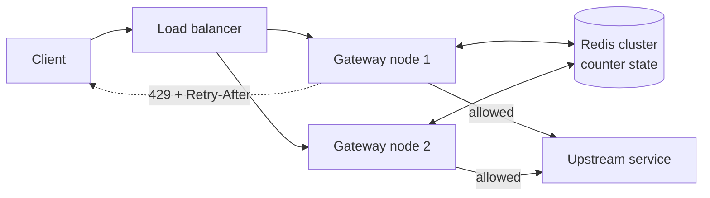

# Rate Limiter — Design

Reject or delay requests that exceed a configured rate, so a small number of callers
cannot consume capacity that belongs to everyone else.

This is the third of three documents: [requirement.md](requirement.md) settles *what* to
build, [back-of-the-envelope.md](back-of-the-envelope.md) sizes it, and this one is the
design that satisfies both.

## Problem

A service has finite capacity. Without a limiter, any single caller can consume all of it:

- **Abuse** — credential stuffing, scraping, spam signups.
- **Accidents** — a customer's retry loop with no backoff, a misconfigured cron firing
  every second instead of every hour.
- **Cost** — per-request downstream spend (LLM tokens, SMS, third-party APIs) that a
  runaway client turns into a five-figure bill overnight.
- **Fairness** — one large tenant starving a hundred small ones on shared infrastructure.

Rate limiting is the admission-control half of resilience. It is not a substitute for
**load shedding** (drop work when *the server* is unhealthy, regardless of who sent it) —
the two solve different problems and mature systems run both.

## Requirements

The full requirements dialogue and the reasoning behind each decision are in
[requirement.md](requirement.md). The contract this design is held to:

| Requirement | Target |
| ----------- | ------ |
| Rules | *N per window*, keyed on identity, tenant, or IP, × endpoint class; most restrictive wins |
| Placement | API gateway tier, after cheap identity extraction, before any expensive work |
| Peak throughput | ~200k QPS design target |
| Added latency | ≤ 5 ms p99, 10 ms hard ceiling |
| Accuracy | ≤ 10% overshoot within a region; 2× is an outage |
| Scope of a limit | Shared across ~13 nodes within a region; no cross-region coordination |
| Store outage | Per-rule fail-open or fail-closed, with degraded local enforcement |
| Client contract | `429` + jittered `Retry-After`; `RateLimit-*` headers on every response; `429` ≠ `503` |
| Memory | Bounded by ~10M active keys, not 100M registered — TTL on every key |
| Config | Reloadable at runtime without redeploying the gateway |
| Telemetry | Per-key usage emitted for dashboards and approaching-limit alerts |

Out of scope: volumetric/DDoS defense (CDN edge), cross-region global limits, load
shedding by server health, and long-window billing quotas.

## Core idea

Keep a small piece of counter state per key. On each request, atomically update that state
and decide. The limiter runs as a filter in the API gateway tier, so rejected traffic never
reaches application servers. Each region has its own Redis cluster; gateway nodes in a
region share it and never talk to another region's.



The whole design reduces to three questions: **what state do you keep per key**, **how do
you mutate it atomically**, and **what happens when the store holding it is unreachable**.

## Approaches

| Algorithm | State per key | Burst behavior | Accuracy | Cost |
| --------- | ------------- | -------------- | -------- | ---- |
| Fixed window counter | 1 integer | Up to **2× limit** across a boundary | Poor | Cheapest — `INCR` + `EXPIRE` |
| Sliding window log | N timestamps | Exact, no burst | Exact | Memory `O(limit)` per key |
| Sliding window counter | 2 integers | Smooth | ~0.003% error in practice | Cheap |
| Token bucket | tokens + timestamp | Burst up to capacity, by design | Good | Cheap |
| Leaky bucket (queue) | queue + timestamp | None — output is perfectly smooth | Good | Needs a queue, adds latency |
| GCRA | 1 timestamp | Configurable burst | Exact | Smallest state of all |

**Fixed window counter.** Key on `user:minute`, `INCR`, set a TTL. Trivially cheap, but a
client sending the limit at 00:00:59 and again at 00:01:00 gets 2× the limit inside a
one-second span. Fine for coarse abuse prevention, wrong for protecting a tight capacity
budget.

**Sliding window log.** Store every request timestamp in a sorted set; drop entries older
than the window, then count what remains. Exact, and it gives you free "when does a slot
free up" answers — but a 10,000/hour limit means 10,000 timestamps per active key.

**Sliding window counter.** Keep the current and previous fixed-window counts and blend
them by how far into the current window you are:

```
estimate = prev_count × (1 − elapsed_in_window / window) + curr_count
```

With a 100/min limit, 80 requests last minute, 20 this minute, 25% elapsed:
`80 × 0.75 + 20 = 80` → allow. Two integers per key, and it removes the boundary spike.
This assumes the previous window's traffic was evenly spread, which is where the (small)
error comes from. **This is the best default for request-count limits.**

**Token bucket.** A bucket holds up to `capacity` tokens and refills at `rate` tokens/sec.
Each request takes one token; empty bucket means reject. Bursts are a *feature* — a client
idle for a minute can spend its accumulated allowance at once, which matches how real
clients behave (page loads, batch syncs). **The best default for public APIs**, and what
most cloud providers expose.

**Leaky bucket.** Requests enter a fixed-size queue drained at a constant rate; a full
queue means reject. Produces perfectly smooth output, which is what you want when
protecting a fragile downstream that cannot absorb any burst. The cost is queueing latency
and the operational hazard of a queue that can fill with stale requests.

**GCRA** (Generic Cell Rate Algorithm). Stores a single "theoretical arrival time" per key
and compares it against now. Mathematically equivalent to a token bucket, exact, and needs
one value instead of two. Used by `redis-cell`. The right pick when key cardinality is huge
and you are counting bytes.

## Deep dive

### Key design

```
rl:{scope}:{identifier}:{rule_id}

rl:user:8f3c21:api_write       → per-user, write endpoints
rl:ip:203.0.113.7:login        → per-IP, login endpoint
rl:tenant:acme:global          → per-tenant across everything
```

Include the rule ID so changing a limit's parameters doesn't reuse stale state. TTL every
key — this is what keeps memory proportional to *active* keys rather than total users.

Evaluate rules most-specific-first and short-circuit on the first denial, so an abusive
caller costs you one lookup rather than all of them.

### Atomic evaluation

The naive read-modify-write is a race: two gateway nodes read `count = 99` and both allow.
Under load this is not rare, it is constant. Options:

1. **`INCR` / `INCRBY`** — atomic on its own, but only expresses fixed-window counting.
2. **Lua script** — Redis runs it atomically on one node. Handles any algorithm. Standard
   choice.
3. **`WATCH`/`MULTI` CAS** — retries under contention, and contention is exactly the case
   you care about. Avoid.

Token bucket as a Lua script:

```lua
-- KEYS[1] = bucket key
-- ARGV[1] = capacity, ARGV[2] = refill rate (tokens/sec), ARGV[3] = tokens requested
local capacity = tonumber(ARGV[1])
local rate     = tonumber(ARGV[2])
local needed   = tonumber(ARGV[3])

-- Redis server clock, so all gateway nodes agree regardless of local clock skew
local t   = redis.call('TIME')
local now = tonumber(t[1]) + tonumber(t[2]) / 1000000

local b      = redis.call('HMGET', KEYS[1], 'tokens', 'ts')
local tokens = tonumber(b[1])
local ts     = tonumber(b[2])

if tokens == nil then          -- first request for this key
  tokens = capacity
  ts     = now
end

tokens = math.min(capacity, tokens + (now - ts) * rate)   -- lazy refill

local allowed = tokens >= needed
if allowed then
  tokens = tokens - needed
end

redis.call('HSET', KEYS[1], 'tokens', tokens, 'ts', now)
redis.call('EXPIRE', KEYS[1], math.ceil(capacity / rate) + 1)

local retry_ms = 0
if not allowed then
  retry_ms = math.ceil((needed - tokens) / rate * 1000)
end

return { allowed and 1 or 0, math.floor(tokens), retry_ms }
```

Two details that bite in practice:

- **Lua returns truncate floats to integers** when converted to the Redis protocol. Return
  scaled integers (milliseconds above), never a raw float, or you will silently ship zeros.
- **`redis.call('TIME')` is non-deterministic.** Harmless on Redis ≥ 5, which replicates
  script *effects*; on older versions it broke replication outright.

Refilling lazily on read — rather than a background job ticking every bucket — is what
makes this scale. Work happens only for keys that are actually being used.

**Cost weighting** falls out for free: pass `needed > 1` for expensive endpoints. This is
how LLM APIs limit on tokens rather than requests, reserving an estimate up front and
reconciling against actual usage afterward.

### Client contract

```http
HTTP/1.1 429 Too Many Requests
RateLimit-Limit: 100
RateLimit-Remaining: 0
RateLimit-Reset: 42
Retry-After: 42
```

Return these headers on **successful** responses too, not just rejections — that is what
lets a well-behaved client self-pace instead of discovering the limit by hitting it.
`Retry-After` is the widely-honored one; the `RateLimit-*` family is an IETF draft that
most large APIs already emit in some form.

Always return a jittered `Retry-After`. Handing every rejected client the same reset
instant guarantees they all return in the same millisecond — you have built a thundering
herd and scheduled it precisely.

### Telemetry

The script's return value is the decision *and* the usage sample. The gateway aggregates
`(key, rule, allowed, denied)` counts in memory and flushes them every 60 s to a stream,
which feeds the customer usage dashboard and an approaching-limit alerter (say, 80% of a
tenant's hourly budget). Do not emit one event per request: it costs more than the
limiter itself and buys nothing at minute granularity.

### Capacity

Worked in full in [back-of-the-envelope.md](back-of-the-envelope.md). The numbers that
shape the design:

```
Design peak              ~200k QPS   → ~500k key-ops/s in Redis after rule fan-out
Redis fleet              20 nodes    (10 primaries + 10 replicas, N+1 per region)
Working set              ~3.75 GB    25M active keys × 150 B, TTL-bounded
Hot-path latency         0.5–3.5 ms  same-AZ RTT + Lua + queueing, inside the 5 ms budget
```

Redis throughput sets the node count and latency headroom sets the utilization target
(~67%). Memory and bandwidth are an order of magnitude under any limit.

## Failure modes & scaling

**Redis is unreachable.** A per-rule policy, decided in config before it happens, and
tripped by a 10 ms timeout on the round trip:

- *Fail open* (allow) — an outage in the limiter doesn't take down the API. The default
  for the general API. The risk is that your limiter dies precisely during the traffic
  spike it existed to contain.
- *Fail closed* (deny) — for rules where exceeding the limit is worse than being down:
  metered spend such as LLM inference routes, or a downstream that collapses under
  overload.

Neither is the whole answer: every gateway node also keeps a **local in-memory bucket per
key** (~50 MB per node), sized at `regional_limit / nodes_in_region`, and enforces
against it while the store is unreachable. Degraded accuracy, no hard dependency. Fail-open
rules use it as a soft cap; fail-closed rules deny outright.

**A caller spanning regions.** Limits are shared within a region, not across them, so a
client hitting all three regions can reach up to 3× its limit. Accepted in the
requirements: traffic is geo-pinned in practice, and a synchronous cross-region hop at
60–150 ms RTT cannot fit inside a 10 ms ceiling. Reconcile asynchronously for dashboards
if the overshoot ever matters.

**Centralized store latency.** Every request paying a network hop is a real cost. The usual
mitigation is a two-tier check: a local token bucket absorbs the common case and syncs to
Redis periodically, with the central store as the source of truth for the long window. You
trade exactness for a limiter that adds microseconds instead of milliseconds.

**Hot keys.** One enormous tenant hashes to a single shard and saturates it, independent of
your total cluster capacity. Mitigations: shard the counter into `N` sub-counters
(`rl:tenant:acme:0..N`) and give each gateway node one, summing for reporting; or absorb
the bulk locally and only reconcile overflow centrally.

**Clock skew.** Any algorithm using wall-clock time across multiple nodes is exposed to
skew. Reading the clock inside the Lua script (as above) means every node uses *Redis's*
clock, which sidesteps this entirely. Do not pass client-side timestamps in as arguments.

**Boundary bursts.** Inherent to fixed windows — the reason to prefer sliding window
counter or token bucket for anything where a 2× overshoot matters.

**IP-keyed limits are a blunt instrument.** Everyone behind one corporate NAT or mobile
carrier gateway shares a key, and IPv6 clients can rotate addresses freely. Key on
authenticated identity wherever you have one; reserve IP keys for pre-auth endpoints like
login and signup, where they are genuinely the only option.

**Retry storms.** Rejections cause retries, and naive clients retry immediately, adding
load exactly when you are shedding it. Jittered `Retry-After` plus documented exponential
backoff is part of the design, not an afterthought.

## In the wild

- **Stripe** — token bucket per user, layered with separate load shedders that reserve
  capacity for critical request types independent of any per-user limit.
- **GitHub API** — 5,000 requests/hour for authenticated callers, with `X-RateLimit-*`
  headers on every response.
- **Cloudflare** — sliding window counter, chosen explicitly for the memory profile at
  their key cardinality; they report error rates far below 1% against exact counting.
- **Envoy** — a local token-bucket filter for per-node limits, plus an external gRPC
  ratelimit service backed by Redis for global ones. The two-tier pattern above, productized.
- **AWS API Gateway** — token bucket exposed directly to users as a rate plus a burst.
- **`redis-cell`** — GCRA as a Redis module, so the atomicity is handled in C rather than Lua.

## References

- [Scaling your API with rate limiters](https://stripe.com/blog/rate-limiters) — Stripe
- [How we built rate limiting capable of scaling to millions of domains](https://blog.cloudflare.com/counting-things-a-lot-of-different-things/) — Cloudflare
- [Rate Limiting, Cells, and GCRA](https://brandur.org/rate-limiting) — Brandur Leach
- [RateLimit header fields for HTTP](https://datatracker.ietf.org/doc/draft-ietf-httpapi-ratelimit-headers/) — IETF draft
- [redis-cell](https://github.com/brandur/redis-cell) — GCRA implementation

## Related

- [requirement.md](requirement.md) — the requirements dialogue this design answers.
- [back-of-the-envelope.md](back-of-the-envelope.md) — the sizing behind the numbers above.
- [common/references.md](../common/references.md) — shared reading list.
- Not yet written: **load shedding** (drop by server health, not caller identity),
  **consistent hashing** (how limiter keys map to shards), **API gateway** (where the
  limiter sits), **Redis** (the store this design leans on).
